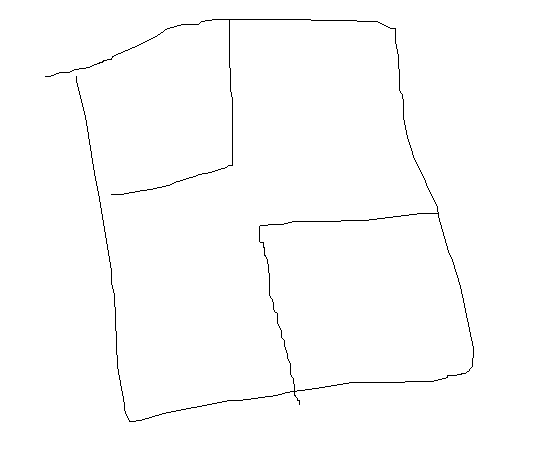

# **경비병 세우기 게임**

[경비병 세우기 게임](https://www.acmicpc.net/problem/18939)

### 문제
Yuto 와 Platina가 보초 세우기 게임이라는 새로운 게임을 해보려고 한다.<br>
이 게임은 N × M의 가로가 긴 격자판에서 진행된다.<br>
게임은 항상 Yuto부터 시작하며, 둘은 번갈아 가면서 자신의 턴에 원하는 빈 위치에 경비병을 세운다.<br>

이 게임에서 '안전상태'라는 것은 격자판 안에 완벽히 포함되는 어떤 K × K 크기의 정사각형에도 1명 이상의 경비병이 있는 상태를 의미한다.

안전상태가 된 순간 게임은 종료되고, 가장 최근 턴을 플레이 한 사람이 이기게 된다.<br>
둘은 이 게임도 너무 재미있기 때문에 T판을 진행하려고 한다.<br>
둘 다 최선의 플레이를 할 때, 모든 게임에 대해서 누가 이길지 예측해보자!

### 입력
첫째 줄에는 둘이 플레이 할 게임의 수 T가 주어진다.

이후 T개의 줄에 각 게임의 게임판의 세로 길이와 가로길이,<br>
그리고 정사각형의 크기를 나타내는 양의 정수 N, M, K가 순서대로 주어진다.

### 출력
각 케이스마다 한 줄에 걸쳐 이기게 될 플레이어의 이름 Yuto 혹은 Platina를 출력한다.
```
제한
1 ≤ T ≤ 100,000
1 ≤ N ≤ 3,000
N ≤ M ≤ 100,000
1 ≤ K ≤ N
```
```
예제 입력 1 
2
1 2 1
3 3 2

예제 출력 1 
Platina
Yuto
```

---
### 풀이
처음으로 푼 다이아 문제라 뭔가 인상 깊습니다.<br>
게임 이론? 수학 문제라 아이디어가 중요한거라 아이디어만 찾으면 구현은 쉽다.<br>

우선 n\*m 직사각형이 있고, 모든 k\*k 크기의 정사각형 안에 경비병이 있으면 마지막 수를 둔 사람이 이긴다.<br>

n\*m 직사각형을 k\*k 크기의 정사각형으로 나누면 2가지의 경우밖에 없다.


이렇게 한 점으로 모든 k\*k 정사각형에 말을 놓을 수 있는 경우는 먼저 두면 이긴다.<br>

위의 경우가 아니라면 반드시 n\*m 직사각형이 k\*k 정사각형 2개 이상으로 나눠진다.<br>



예를 들어 위의 그림이라고 하면, 2개의 정사각형을 제외한 모든 곳에 말을 놓을 것이다.<br>
왜냐하면 저 정사각형 중 먼저 1개를 채우면 남은 사람이 나머지 하나를 채우며 이기기 때문이다.<br>

여기서 생각난 의문이 만약 저 정사각형 2개를 가장 처음에 두면 어떻게 되지?<br>
였는데 그림 때문에 생긴 착각이었다.<br>
꼭 그림처럼 남는 것이 아니라 n\*m 직사각형을 k\*k로 최대한 나눈다고 생각하면 어디에서라도<br>
k\*k범위 2개만큼의 빈 공간이 남는 상황이 발생하고, 지는 수를 두지 않기에<br>
그 2개의 범위를 제외한 모든 곳에 수를 두게 되는 것이다.

그래서 case를 가장 먼저 놓을 때 이기는 경우와 n\*m-2\*k\*k를 다 채우는 경우로 나누면 된다.<br>

```c++
#include <iostream>
#include <vector>
#include <string>
#include <tuple>
#include <stack>
#include <set>
#include <queue>
#include <algorithm>
#include <math.h>
using namespace std;
long long maxi=0;
int n;

int main()
{
    ios_base ::sync_with_stdio(false);
    cin.tie(NULL);
    cout.tie(NULL);
    int a, b, c, m, k;
    int t;

    cin >> t;
    while(t-->0){
        cin >> n >> m >> k;
        //서로 다른 2개가 있으면 n*m-2*k*k가 짝수인지 홀수인지에 따라.
        //아니면 무조건 yuto가 이기는거 아님?
        if(m/2 < k){
            cout << "Yuto\n";
        }
        else{
            if((n*m-2*k*k)%2==1)cout << "Yuto\n";
            else cout << "Platina\n";
        }
    }
    return 0;
}
```
