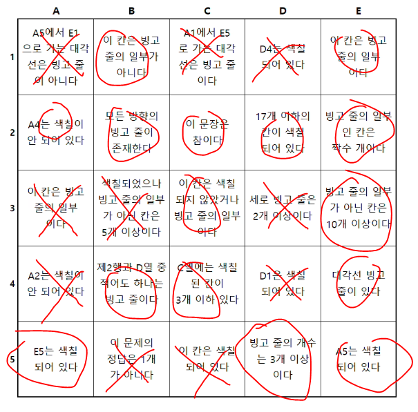

# **빙고**

[빙고](https://www.acmicpc.net/problem/17106)

### 문제
구데기컵에 나온 빙고를 푸는 문제이다.


### 풀이
재밌어 보이고 티어도 높아서 1시간 동안 열심히 풀었는데 점수를 안 준다고 한다. ㅠ<br>


그래도 푸는 과정이 퍼즐 푸는 것 같아서 재밌었다.<br>

우선 C3는 반드시 참이다. 색칠되지 않으면 모순이 생기기 때문이다.<br>
B1이 참이 아니라면 빙고줄의 일부지만 체크가 되면 안되므로 모순이 생기니 B1도 참이다.<br>
A2와 A4중 하나만 참이고, D1-D4, A5-E5는 같은 결과를 가진다.<br>


이 상태에서 처음에 대각선 빙고가 없다고 가정하고 체크를 해봤다.<br>
그러면 A1은 참, C1은 거짓, E4는 거짓이다. E1도 빙고가 될 수 없으므로 거짓이다.<br>
대각선 방향 빙고 줄도 없으니 B2도 거짓이다.


그러면 이 상태인데, A2와 A4는 같이 체크가 안되므로 세로 줄은 2개 이상이 될 수 없다.<br>
그러면 D3로 거짓, A3도 빙고가 될 수 없게 된다. 이 상태에서 어떻게 해도 빙고 줄은 3개 이상이 안 된다.<br>
제 2행과 D열에 X가 있으므로, B4도 거짓. E3는 참이 된다.


이러면 빙고가 생길 수가 없게 되버린다. C3는 빙고 줄의 일부여야하므로 모순이 생긴다.<br>

즉 대각선이 없다는 가정은 틀렸다. 다시 2번째 그림으로 돌아가자.<br>


우선 대각선 빙고 줄은 있다는 것이다. A1에 의해 양방향이 대각선 줄일 수는 없다.<br>
그래서 1개의 대각선 빙고가 있다는 것을 알았고, 우선 오른쪽 아래가 빙고라고 가정했다.<br>
이제 E4는 무조건 참이고, C1도 참이 된다.<br>

그렇게 다 칠하고 D4가 참이면 D1도 참, E5가 참이면 E1도 참이다.


B1칸은 빙고가 아니므로 E1은 거짓이다.<br>
그런데 A는 A2-A4에 의해 빙고가 아니고, B는 B1에 의해 빙고가 되지 못한다.<br>
또, C도 C4에 의해 빙고가 되지 못한다. B2가 참이라고 가정했기에 모든 방향의 빙고줄이 있는데<br>
D3가 참일 수가 없는 것이 세로 빙고 줄이 2개보다 적다. 즉 세로 빙고를 만들 수가 없어 모순이다.<br>


이렇게 소거법으로 오른쪽 아래로 가는 대각선 빙고는 불가능하고 답은 오른쪽 위 대각선이구나 알았다.<br>


여기까지는 금방 채울 수 있다.<br>
이제 갈래길을 정하는 것은 B4이다. 우선 D열이 참일 때를 가정해보자.<br>
그러면 세로 빙고 줄이 2개 이상인데, A, B, C는 빙고가 아니므로 E가 빙고여야 한다.<br>


현재 빙고 줄의 일부분은 13개이다.<br>
E2에 의해 빙고 줄은 짝수이므로 빙고가 더 필요하고, 세로줄은 더 못만드니 가로줄 빙고가 있다.<br>
그렇기에 B2가 참이 된다. 그러면 색칠된 칸이 15개가 되었다.<br>

D2에 의해 2칸밖에 더 못 칠하게 되었다.<br>
가로 빙고는 만들어야 하므로 2, 3, 4, 5 중 한 줄만 빙고, 나머지는 전부 X이다.<br>
E2 조건을 위해 가능한 빙고는 2번 밖에 없다.<br>


이러고 나머지는 다 X여야하는데, C4에서 모순이 생겼다.<br>
즉 D열이 참이라는 것을 틀렸다.. 이제 다시 돌아가자.<br>


여기로 다시 왔고, 2행은 참, D행은 거짓이라는 것을 알았다.<br>
2행을 다 칠하니 A4는 X이다.


B2에 의해 모든 뱡향의 빙고 줄이 존재하는데 세로 줄이 가능한건 D와 E이다.<br>
그런데 D가 빙고가 아님은 위에서 봤다.<br>
즉, E가 빙고이고 D3는 당연히 거짓이 된다.<br>
모든 방향의 빙고 줄이 존재하니까 D5 역시 반드시 참이 된다.<br>


이제 C4를 보는데 C4가 거짓이면 C열에 색칠 칸이 4개 이상인건데 모순이 생긴다.<br>
그렇기에 C4는 참이고, C5가 거짓이 된다.<br>
A3는 빙고줄이 될 수 없는 칸이 되어버렸으니까 거짓이다.


빙고인 칸 12개, 색칠한 칸 15개. 거의 다 한 것 같다.<br>
여기서 D1, D4는 한 세트인데 색칠하면 빙고 12, 색칠 17이 된다.<br>
그런데 B3 색칠되었으나 빙고 줄의 일부가 아닌 칸이 5개 이상이다 라는 조건이 만족해버린다.<br>
그러면 색칠한 칸이 18개가 되므로 D2에 모순이 생긴다.<br>

즉, D1과 D4는 같이 거짓이 되고, B3 역시 거짓이 된다.<br>


지금까지 논리적으로 거쳐왔기 때문에 틀린 것은 없다고 생각을 해야한다.<br>
이제 1칸 남은 상태인데, 정답이 2개일 수가 없다. 그러므로 B5도 거짓이다.<br>



딱 이렇게 풀고 제출을 해서 맞았는데.. 점수가 안 올라서 좀 슬펐다.<br>
그래도 문제는 재밌었으니까 용서하자.

```text
.#..#
#####
..#.#
.##.#
#..##
```
