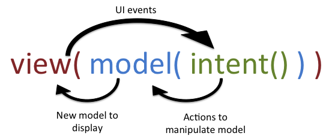

> 최근 안드로이드 보안을 공부하는데 학교에서 모바일 프로그래밍 과목을 듣고 있어서 내용을 이해하기 수월했다.<br>
> 역시 보안을 제대로 알기 위해서는 개발도 같이 잘 알아야 한다고 새삼 느꼈다.<br> 

# **1. 안드로이드 운영체제 이해**

[안드로이드 운영체제 입문] https://product.kyobobook.co.kr/detail/S000213637137<br>
이 글은 해당 책과 자료를 참고하고 제가 추가로 공부한 내용으로 작성하였습니다.

우선 안드로이드는 자바 기반의 플랫폼에서 동작한다.<br>
자바는 객체와 클래스가 있고, 안드로이드 앱에서도 당연히 같은 원리가 적용된다.<br>
액티비티, 서비스, fragment 등의 크래스를 사용해서 앱의 컴포넌트를 구현한다.<br>

변수와 클래스를 묶는 캡슐화, 상속 같은 것도 당연히 사용하고 코드의 재사용성을 높인다.<br>

코틀린은 2017년부터 안드로이드 공식 개발 언어로 채택되었고, 간결하고 표현력이 뛰어나다는 장점이 있다.<br>
NULL 안정성, 데이터 클래스, 람다 식 등의 기능을 제공해서 간결한 코드 작성을 돕는다.<br>

코틀린은 자바와 상호 운용이 가능하기 때문에 기존의 자바 코드와도 쉽게 통합이 된다.<br>

## 안드로이드 아키텍처 설계

소프트웨어 개발론에서 디자인 패턴은 재사용성이 높은 형태로 규약을 붙여서 정리한다.<br>
MVC(Model-View-Controller), MVP(Model-View_presenter), MVVM(Model-View-ViewModel)이 주요 아키텍처 모델로 사용된다.<br>

### MVC
안드로이드 앱에서 가장 많이 사용하는 MVC 패턴은 소프트웨어의 비즈니스 로직과 화면을 구분하는데 중점을 두고 있다.<br>
- **모델** : 데이터와 비즈니스 로직을 관리 (DB, 네트워크 요청, 파일 입출력 등 작업 처리) 상태 변화에 따라 알림 전달
- **뷰** : 데이터를 시간적으로 제공하고, 액티비티, 프래그먼트, XML, 레이아웃 등 UI 요소 관리
- **컨트롤러** : 모델과 뷰 사이에서 데이터 흐름을 관리. 액션에 따라 작업을 수행.

컨트롤러는 뷰에서 받은 사용자 입력을 처리하고, 모델과 뷰를 조정하여 앱의 동작을 제어한다.<br>
안드로이드에서는 액티비티와 프래그먼트가 뷰와 컨트롤러의 역할을 동시에 수행한다고 한다.<br>

```
사용자 <-> view : 사용자가 입력을 하고, view는 화면을 보여줌
view <-> controller : view는 컨트롤러에 이벤트를 전달하고, 컨트롤러는 view에 ui 갱싱
controller <-> model : 데이터 상호 작용
```
<br>
[출처 : https://developer.mozilla.org/ko/docs/Glossary/MVC]

코드를 예시로 보면
``` kotlin
// model
class CountModel {
    private var count = 0

    fun getCount(): Int = count

    fun increment() {
        count++
    }
}
```
```xml
// view
<?xml version="1.0" encoding="utf-8"?>
<LinearLayout xmlns:android="http://schemas.android.com/apk/res/android"
    android:orientation="vertical" android:layout_width="match_parent"
    android:layout_height="match_parent" android:gravity="center">

    <TextView
        android:id="@+id/countText"
        android:text="0"
        android:textSize="40sp"
        android:layout_width="wrap_content"
        android:layout_height="wrap_content"/>

    <Button
        android:id="@+id/incrementButton"
        android:text="Increment"
        android:layout_width="wrap_content"
        android:layout_height="wrap_content"/>
</LinearLayout>
```
```kotlin
// controller
class MainActivity : AppCompatActivity() {

    private lateinit var model: CountModel

    override fun onCreate(savedInstanceState: Bundle?) {
        super.onCreate(savedInstanceState)
        setContentView(R.layout.activity_main)

        model = CountModel()

        val countText: TextView = findViewById(R.id.countText)
        val incrementButton: Button = findViewById(R.id.incrementButton)

        incrementButton.setOnClickListener {
            model.increment()
            countText.text = model.getCount().toString()
        }
    }
}
```
이렇게 model은 데이터와 로직을 캡슐화, view는 UI 구성을 담당, controller는 model과 view를 연결해 갱신을 한다.<br>
MainActivity는 AppCompatActivity를 상속 받고, onCreate는 Activity가 처음 실행될 때 호출된다.<br>
역할은 활동의 UI를 초기화하고, 화면에 표시될 뷰를 생성한다. <br>
setContentView(R.layout.activity_main)를 통해서 뷰가 보이게 되고, 이후 model을 통해 기능을 실행한다.<br>

MVC 패턴은 규모가 작은 앱에서는 개발 기간을 단축할 수 있지만, 시간이 지날수록 코드의 양이 증가하고<br>
유지보수가 어렵다는 단점이 있다고 한다. 또 컨트롤러가 뷰와 모델에 의존해 결합도가 높아 unit test가 어렵다.<br>

---
### MVP
MVC 패턴의 단점인 높은 결합도를 해결하기 위해 프레젠터라는 개념이 있는 MVP 패턴이 사용된다.<br>
모델과 뷰의 역할은 비슷하지만 컨트롤러 대신 프레젠터가 뷰와 모델을 분리한다.<br>

- **모델** : 데이터와 비즈니스 로직을 관리 (DB, 네트워크 요청, 파일 입출력 등 작업 처리) 상태 변화에 따라 알림 전달
- **뷰** : 데이터를 시간적으로 제공하고, 액티비티, 프래그먼트, XML, 레이아웃 등 UI 요소 관리
- **프레젠터** : 뷰와 모델의 중간 계층으로 두 계층 사이에서 상호작용을 관리한다.

```
사용자 <-> view : 사용자가 입력을 하고, view는 화면을 보여줌
view <-> presenter : view는 컨트롤러에 이벤트를 전달하고, 컨트롤러는 view에 ui 갱싱
presenter <-> model : 데이터 상호 작용
```
<br>
[출처 : https://en.wikipedia.org/wiki/Model%E2%80%93view%E2%80%93presenter]

이렇게 설명만 봐서는 MVC와 MVP의 차이가 무슨 차이인지 모르겠다.

코드를 예시로 보면
``` kotlin
// model
class CountModel {
    private var count = 0

    fun getCount(): Int = count

    fun increment() {
        count++
    }
}
```
```kotlin
// view
interface CountView {
    fun showCount(count: Int)
}
```
```kotlin
// Activity
class MainActivity : AppCompatActivity(), CountView {

    private lateinit var presenter: CountPresenter
    private lateinit var countText: TextView
    private lateinit var incrementButton: Button

    override fun onCreate(savedInstanceState: Bundle?) {
        super.onCreate(savedInstanceState)
        setContentView(R.layout.activity_main)

        countText = findViewById(R.id.countText)
        incrementButton = findViewById(R.id.incrementButton)

        presenter = CountPresenter(this)

        incrementButton.setOnClickListener {
            presenter.onIncrementButtonClicked()
        }
    }

    override fun showCount(count: Int) {
        countText.text = count.toString()
    }
}
```
```kotlin
// presenter
class CountPresenter(private val view: CountView) {
    private val model = CountModel()

    fun onIncrementButtonClicked() {
        val newCount = model.increment()
        view.showCount(newCount)
    }
}
```
아까 mvc에서 Activity에 같이 있었던 함수 호출을 CountPresenter가 처리하고 있다.<br>
mvc는 Activity가 View이자 Controller 역할까지 했지만 mvp는 Presenter가 명확히 로직 담당을 한다.<br>
모델과 뷰의 의존성이 없어지므로 관련된 코드만 수정하는 것이 간편해졌고, 분리도 잘 된다.<br>

하지만 프레젠터와 뷰가 1:1 관계를 가지기 때문에 프로젝트가 커질수록 프레젠터도 늘어나게 된다.<br>

---
### MVVM
MVVM 모델은 모델 - 뷰 - 뷰모델의 패턴을 가진 아키텍처이다.<br>
역시 목적은 기능을 명확히 분리하여 유지보수, 테스트, 코드 재사용을 쉽게 해준다.

- **모델** : 데이터와 비즈니스 로직을 관리 (DB, 네트워크 요청, 파일 입출력 등 작업 처리) 상태 변화에 따라 알림 전달
- **뷰** : 데이터를 시간적으로 제공하고, 액티비티, 프래그먼트, XML, 레이아웃 등 UI 요소 관리
- **뷰 모델** :  View를 표현하기 위해 만든 모델로 view를 직접 참조하지는 않는다.

```
사용자 입력 → View → ViewModel → Model → ViewModel → View 

사용자 <-> view : 사용자가 입력을 하고, view는 화면을 보여줌
view -> viewmodel : view는 viewmodel에 이벤트를 전달하고
viewmodel -> model : viewModel은 model에 데이터 요청 및 결과 처리
viewModel → view : viewModel은 LiveData를 통해 view에 상태 전달
view는 vewModel의 LiveData를 통해 화면을 갱신한다.
```
<br>
[출처 : https://en.wikipedia.org/wiki/Model%E2%80%93view%E2%80%93viewmodel]

역시 코드를 예시로 보면
``` kotlin
// model
class CountModel {
    private var count = 0

    fun getCount(): Int = count

    fun increment() {
        count++
    }
}
```
```kotlin
// view
class MainActivity : AppCompatActivity() {

    private lateinit var viewModel: CountViewModel
    private lateinit var countText: TextView
    private lateinit var incrementButton: Button

    override fun onCreate(savedInstanceState: Bundle?) {
        super.onCreate(savedInstanceState)
        setContentView(R.layout.activity_main)

        countText = findViewById(R.id.countText)
        incrementButton = findViewById(R.id.incrementButton)

        viewModel = ViewModelProvider(this)[CountViewModel::class.java]

        // ViewModel에서 count가 바뀌면 UI 자동 업데이트
        viewModel.count.observe(this) { updatedCount ->
            countText.text = updatedCount.toString()
        }

        incrementButton.setOnClickListener {
            viewModel.increment()
        }
    }
}
```
Activity.xml은 존재한다고 가정. (간단한 UI)
```kotlin
// viewmodel
class CountViewModel : ViewModel() {
    private val model = CountModel()

    private val _count = MutableLiveData<Int>()
    val count: LiveData<Int> get() = _count

    init {
        _count.value = model.getCount()
    }

    fun increment() {
        _count.value = model.increment()
    }
}
```
이렇게 view와 viewmodel로 연결하고, UI는 자동으로 갱신되게 하면 상태 관리가 편해진다.<br>
또 View와 Model 사이의 의존성, View와 View Model 사이의 의존성 또한 없앴기 때문에 모듈화가 잘 되었다.<br>

단점으로는 구조가 복잡해서 만드는 것이 복잡하다는 것이 있다.

---
### MVI
마지막으로 MVI 모델은 모델 - 뷰 - 인텐트 패턴을 가진 아키텍처이다.<br>
역시 목적은 상태를 명확하게 관리하고, 단방향 데이터 흐름을 통해 예측 가능한 UI를 만드는 것이다.

- **모델** : 데이터와 비즈니스 로직을 관리 (DB, 네트워크 요청, 파일 입출력 등 작업 처리) 상태 변화에 따라 알림 전달
- **뷰** : 사용자가 보는 UI. 상태(State)를 받아서 화면을 렌더링할 뿐이며, ViewModel을 직접 참조 X
- **인텐트** : 사용자의 **행위(의도)**를 표현한 이벤트 객체이며, ViewModel에서 받아서 처리
- **뷰모델** : 사용자의 인텐트를 받아 상태를 처리하고, 새로운 상태를 View에 전달

```
사용자 입력 → Intent → ViewModel → Model(State 처리) → New State → View

사용자 <-> View : 사용자는 버튼 클릭 등의 입력을 하고, View는 상태를 렌더링하여 화면을 보여줌  
View → Intent : View는 사용자의 행동을 Intent로 만들어 ViewModel에 전달함  
Intent → ViewModel : ViewModel은 Intent를 받아서 비즈니스 로직 처리  
ViewModel → Model : ViewModel은 모델을 통해 상태를 업데이트  
Model → ViewModel : 새로운 상태를 생성하고  
ViewModel → View : View에 상태(State)를 전달  
View는 전달받은 상태만을 기반으로 UI를 갱신
```
<br>

역시 코드를 예시로 보면
``` kotlin
// state
data class CounterState(
    val count: Int = 0
)
```
``` kotlin
// intent
sealed class CounterIntent {
    object Increment : CounterIntent()
}
```
```kotlin
// view
class MainActivity : AppCompatActivity() {

    private lateinit var viewModel: CounterViewModel
    private lateinit var countText: TextView
    private lateinit var incrementButton: Button

    override fun onCreate(savedInstanceState: Bundle?) {
        super.onCreate(savedInstanceState)
        setContentView(R.layout.activity_main)

        countText = findViewById(R.id.countText)
        incrementButton = findViewById(R.id.incrementButton)

        viewModel = ViewModelProvider(this)[CounterViewModel::class.java]

        viewModel.state.observe(this) { state ->
            countText.text = state.count.toString()
        }

        incrementButton.setOnClickListener {
            viewModel.handleIntent(CounterIntent.Increment)
        }
    }
}
```
Activity.xml은 존재한다고 가정. (간단한 UI)
```kotlin
// viewmodel
class CounterViewModel : ViewModel() {
    private val _state = MutableLiveData(CounterState())
    val state: LiveData<CounterState> = _state

    fun handleIntent(intent: CounterIntent) {
        when (intent) {
            is CounterIntent.Increment -> {
                val current = _state.value ?: CounterState()
                _state.value = current.copy(count = current.count + 1)
            }
        }
    }
}
```
사용자 입력 → Intent → ViewModel → Model(State 처리) → New State → View라는 단방향 흐름으로<br>
작업을 처리하는 엄격한 구조이기에 상태의 불변성이 지켜져 예측 가능한 상태를 만들기 좋다고 한다.<br> 

---
설계 아키텍처는 앱의 동작과 구조에 대한 이해를 제공한다.<br>
뷰와 모델 간의 의존성을 줄이면 데이터 누출 방지를 하고, 계층화된 아키텍처는 접근 제어에 효과적이다.<br>
이런 견고한 아키텍처 설계가 보안 취약점을 줄이는데 중요하다.<br>