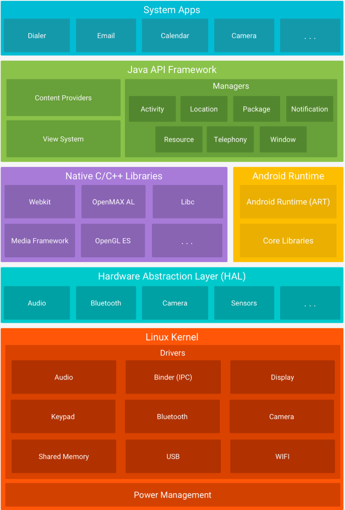

# **2. 안드로이드 보안 기초**

[안드로이드 운영체제 입문] https://product.kyobobook.co.kr/detail/S000213637137 
이 글은 해당 책과 자료를 참고하고 제가 추가로 공부한 내용으로 작성하였습니다.

## 안드로이드 설계 원칙
어떤 아키텍처를 만들 때 지켜야 할 보안적 관점론 이야기이다. 
다른 것과 크게 다르지는 않다. 

스마트폰은 웨어러블 기기나 사물 인터넷 기기를 연결하고 동작과 제어를 하며 광점위한 연결성이 생겼다. 
소프트웨어 설계 원칙으로 로버트 마틴이 말한 다섯 가지 원칙인 SOLID 원칙을 지켜야 한다.

- **S : 단일 책임의 원칙 (Sigle Responsibility Principle)** 
하나의 클래스는 하나의 책임만 가져야 한다는 것으로 클래스가 여러가지 역할을 수행하면 코드가 복잡해진다. 
또한 인증과 DB 접근 기능이 하나의 클래스에 있다면 하나의 취약점이 파급력이 더 커지는 결과를 낳을 수 있다. 

- **O : 개방 폐쇄의 원칙 (Open Close Principle)** 
기존의 코드를 변경하지 않고 새로운 기능을 추가할 수 있도록 설계해야한다. 
새로운 기능을 추가할 때 기존의 코드를 바꾸면서 다른 사용하고 있는 곳에 영향을 미치므로, 새로운 취약점이 생길 수 있다. 

- **L : 리스코프 치환 원칙 (Liscov Substitution Principle)** 
인터페이스나 부모 클래스를 사용하는 곳에서 자식 클래스를 사용해도 문제가 발생하면 안된다는 것이다. 
자식 클래스가 잘못된 오버로딩을 하거나, 자식 클래스에만 특별한 기능을 추가해서 부모 클래스를 사용하던 곳에서 
대체할 수 없게 되거나 잘못된 상속 관계로 호환성을 지키지 못할 때 등이 있다.

- **I : 인터페이스 분리 원칙 (Interface Segregation Principle)** 
각 인터페이스는 단독으로 동작해야 한다는 것으로 사용하지 않는 인터페이스를 구현하면 안된다. 
하나의 큰 인터페이스를 상속 받기보다는 구체적이고 작은 단위로 분리시켜 필요한 것만 사용해야 한다. 

- **D : 의존 역전 원칙 (Dependency Inversion Principle)** 
의존 관계는 추상화에 의존해야 하며 구체적인 구현에 의존해서는 안된다는 것이다. 
예를 들어 DB 접근 추상 클래스가 특정한 구체적인 DB에 의존한다면 우선 다른 DB 접근할 때 해당 코드를 사용할 수 없고 
특정 DB에서 발생한 취약점이 전체 앱에 영향을 미치게 된다.

이 기본 원칙은 코드의 활용성을 높이고, 보안 취약점을 없애는데 큰 도움이 된다. 

## 안드로이드 운영체제 구조
안드로이드 운영체제는 사용자, 애플리케이션, 운영체제로 구성된다. 

안드로이드 앱은 권한을 요구하고 정보를 처리하며 운영체제는 시스템 명령을 실행한다. 
보통 취약점 진단을 할 때는 애플리케이션 수준에서 진행하고, 코드, 권한, 통신 구간 등을 분석한다. 

 

사진에서 가장 하위에 존재하는 것은 리눅스 기반의 커널이다. 