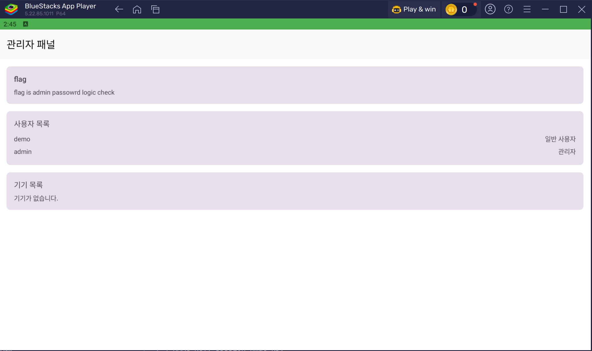

Smart Grid 문제이다.<br>
우선 블루스택으로 앱을 켰는데 바로 꺼지는 것을 보니 루팅 감지가 있는 듯 하다.<br>
그래서 루팅 권한을 뺀 다음 앱을 다시 켜보니


이렇게 로그인 화면을 볼 수 있다.<br>
입력되어 있는 정보로 로그인을 하면 딱히 눈에 띄는 기능은 보이지 않고 


이렇게 demo/일반 사용자라고 있는 것을 보아 admin도 있지 않을까 생각을 했다.<br>
비밀번호를 복사해보면 demo1234인 것을 확인할 수 있다.

다음 jadx로 apk를 열어 MainActivity를 분석해보면
```java
 private final void loadDynamicDex() {
        try {
            Log.d(TAG, "Starting Dynamic DEX Loading...");
            File fileQ = s0.a.q(this);

```
동적으로 dex 파일을 가져와서 런타임 로드를 하고, <br>
performInitialSecurityCheck() 함수를 통해서 Frida, 디버거, 루팅 탐지를 하고 있다.<br>

로그인을 한 후에 루트 권한을 켜면 앱은 꺼지지만 앱의 database나 shared_prefs에 접근할 수 있다.<br>

우선 database를 보면

```sql
taimen:/data/data/mobilehacking.kr.smartgrid/databases # ls
smartgrid_database smartgrid_database-shm smartgrid_database-wal
taimen:/data/data/mobilehacking.kr.smartgrid/databases # sqlite3 sma
smartgrid_database      smartgrid_database-shm  smartgrid_database-wal
qlite3 smartgrid_database                                                                                             <
SQLite version 3.22.0 2019-09-03 18:36:11
Enter ".help" for usage hints.
sqlite> .tables
android_metadata   power_usages       users
devices            room_master_table
sqlite> .schema users
CREATE TABLE `users` (`id` INTEGER PRIMARY KEY AUTOINCREMENT NOT NULL, `username` TEXT NOT NULL, `password` TEXT NOT NULL, `email` TEXT NOT NULL, `isAdmin` INTEGER NOT NULL, `lastLogin` INTEGER NOT NULL);
sqlite> SELECT id, username, password, isAdmin FROM users;
1|demo|0ead2060b65992dca4769af601a1b3a35ef38cfad2c2c465bb160ea764157c5d|0
2|admin|fd48d4edbe78b5fda5214c|1
sqlite>
```
이렇게 demo와 admin의 계정이 있음을 알 수 있고,<br>
password라는 column에 저장이 되어있는 값은 암호화되어서 저장된 비밀번호라고 생각할 수 있다.<br>

MainActivity를 보면 private i authManager;로 정의가 되어있어서 i를 분석해보면

```java
public static String d(User user) throws IllegalStateException, NoSuchAlgorithmException, InvalidKeyException {
        String str = user.getId() + ":" + user.getUsername() + ":" + user.getPassword() + ":" + user.isAdmin();
        byte[] bArr = a0.O;
        ArrayList arrayList = new ArrayList(16);
        int i = 0;
        for (int i2 = 0; i2 < 16; i2++) {
            arrayList.add(Byte.valueOf((byte) (bArr[i2] ^ 90)));
        }
        byte[] bArr2 = new byte[arrayList.size()];
        Iterator it = arrayList.iterator();
        while (it.hasNext()) {
            bArr2[i] = ((Number) it.next()).byteValue();
            i++;
        }
        Charset charset = c1.a.f471a;
        String str2 = new String(bArr2, charset);
        s0.c.n(str, "data");
        Mac mac = Mac.getInstance("HmacSHA256");
        byte[] bytes = str2.getBytes(charset);
        s0.c.m(bytes, "this as java.lang.String).getBytes(charset)");
        mac.init(new SecretKeySpec(bytes, "HmacSHA256"));
        byte[] bytes2 = str.getBytes(charset);
        s0.c.m(bytes2, "this as java.lang.String).getBytes(charset)");
        byte[] bArrDoFinal = mac.doFinal(bytes2);
        s0.c.k(bArrDoFinal);
        return r.x0(bArrDoFinal, w.f166p);
    }

```

이렇게 세션을 만드는 코드가 있다.<br>

```java
byte[] bArr = a0.O;
        ArrayList arrayList = new ArrayList(16);
        int i = 0;
        for (int i2 = 0; i2 < 16; i2++) {
            arrayList.add(Byte.valueOf((byte) (bArr[i2] ^ 90)));
        }

```
a0.O 배열을 90으로 xor한 값이 HMAC key로 사용되므로 
```java
public static final byte[] O = {41, 105, 41, 41, 107, 106, 52, 5, 50, 55, 59, 57, 5, 49, 105, 35};
```
복호화 하면 HMAC Key: s3ss10n_hmac_k3y 임을 알 수 있다.<br>

이제 database에 있던
```sql
1|demo|0ead2060b65992dca4769af601a1b3a35ef38cfad2c2c465bb160ea764157c5d|0
```
값을 가지고 세션을 만드는 로직에 넣어보면 
```
============================================================
[Demo Account]
============================================================
[*] HMAC Key: s3ss10n_hmac_k3y
[*] Data to sign: 1:demo:0ead2060b65992dca4769af601a1b3a35ef38cfad2c2c465bb160ea764157c5d:false
[*] Session Token: 837f04183eca161a61410c59757c964cf67b9d02700272caf2c1587c809c565f
```
이런 결과를 볼 수 있고, Session Token에 있는 값은 
```xml
taimen:/data/data/mobilehacking.kr.smartgrid/shared_prefs # cat auth_prefs.xml
<?xml version='1.0' encoding='utf-8' standalone='yes' ?>
<map>
    <string name="session_token">837f04183eca161a61410c59757c964cf67b9d02700272caf2c1587c809c565f</string>
    <long name="user_id" value="1" />
    <string name="username">demo</string>
</map>
```
로그인 했을 때 shard_prefs에 저장되어있는 값과 일치한다.

그러면 admin의 정보를 가지고 session 하이재킹이 가능할 것이라 생각했고
```sql
2|admin|fd48d4edbe78b5fda5214c|1
```

이 정보를 통해서 세션을 만든 다음 
```xml
<?xml version='1.0' encoding='utf-8' standalone='yes' ?>
<map>
    <string name="session_token">ad1e2397ab33fb2e89b38194b9aecc91412ae03780e24129910404d8180bbaa5</string>
    <long name="user_id" value="2" />
    <string name="username">admin</string>
</map>
```
다시 앱을 켜보면 



이렇게 관리자 계정으로 로그인이 잘 되었음을 확인할 수 있다.<br>
database를 읽거나 xml 조작 과정에는 루팅 권한이 필요하지만 앱을 켤 때는 루팅 권한이 없어야 하니 잘 봐야 한다.<br>

그런데 보다시피 flag가 바로 나오는 것이 아닌 logic check 과정에 flag가 있다고 한다.<br>
무슨 말일까 생각을 해보면 세션 만들 때 쓴 값이 암호화 된 PW 값이었으니까 진짜 PW를 구하라는 뜻이 아닐까 싶다.

logcat을 켜고 조금 더 보니
```
12-26 14:06:05.097  6877  6877 D BoundBrokerSvc: onUnbind: Intent { act=com.google.android.gms.measurement.START pkg=com.google.android.gms }
12-26 14:06:07.787 12538 12559 D AuthManager: 로그인 성공: demo
```
이렇게 로그인 했을 때 로그가 남길래 이 부분은 jadx에서 따라갔다.

```java
boolean zIsAdmin = user.isAdmin();
            String str2 = this.f1239h;
            if (zIsAdmin) {
                try {
                    zT = c1.g.T(new q1.a().a(str2), user.getPassword());
                } catch (Exception e2) {
                    Log.e("AuthManager", "관리자 비밀번호 비교 실패", e2);
                    zT = false;
                }
            } else {
                zT = s0.c.e(user.getPassword(), m.r(str2));
            }
            if (!zT) {
                Log.d("AuthManager", "로그인 실패: 비밀번호 불일치");
                return Boolean.FALSE;
            }
            i.a(iVar, user);
            Log.d("AuthManager", "로그인 성공: " + str);
            return Boolean.TRUE;
        } catch (Exception e3) {
            Log.e("AuthManager", "로그인 중 오류 발생", e3);
            return Boolean.FALSE;
        }
```

그러니 이렇게 비밀번호 값을 받고, 암호화하는 코드가 있는 것 같다.<br>
q1.a의 코드를 보면 RC4로 암호화되어서 저장을 하고 있었고 복호화 코드를 짜서 실행하면

```
[*] RC4 Key: gr33nP0w3rS3cur1ty

============================================================
[+] ADMIN PASSWORD (FLAG): smartic_0-0
============================================================
```
이렇게 최종 flag는 flag{smartic_0-0} 로 구할 수 있다.